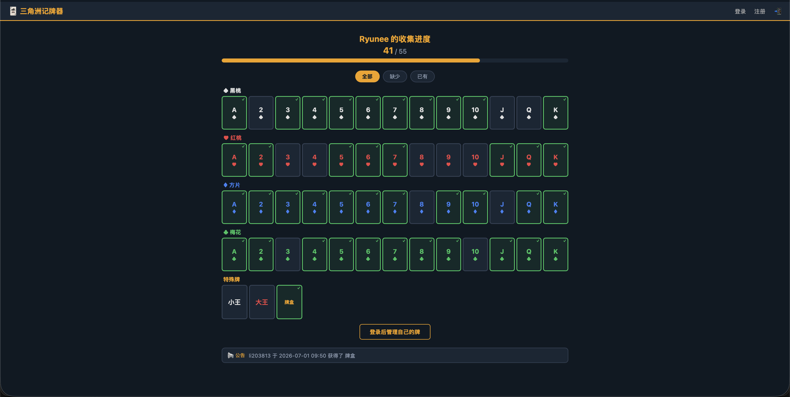

# DFpoke - 三角洲记牌器

[🇬🇧 English](README.md)

三角洲行动扑克牌收集活动记牌器。活动共 54 张扑克牌 + 1 个牌盒，共 55 张，本工具帮你追踪收集进度。

**在线体验：** [http://dfpoke.site](http://dfpoke.site)

## 截图



## 功能介绍

### 个人记牌器
注册账号后，每位用户拥有独立的记牌页面 `/<用户名>`。卡牌按花色分组，每行 13 张网格展示（黑桃/红桃/方片/梅花），特殊牌（小王/大王/牌盒）单独一栏。点击卡牌即可切换已有/未有状态，顶部进度条和计数器实时更新。

### 排行榜
首页展示所有玩家的收集进度排名，按已收集数量降序排列。玩家可以在自己的记牌页面通过开关控制是否在排行榜中显示。

### 截图 OCR 识别
上传游戏仓库截图，自动识别已拥有的卡牌。主引擎为**百度 OCR**（高精度模式），备用引擎为**Tesseract.js**（浏览器端本地识别）。图片在上传前会自动压缩以加快处理速度。识别采用严格匹配策略——优先保证查准率，宁愿少识别也不误识别。

### 筛选查看
支持按状态筛选卡牌：全部 / 缺少 / 已有。没有可见卡牌的花色区域会自动隐藏，方便快速查看还缺哪些牌。

### 每日口令
自动从三角洲行动 API 获取并展示每日口令码，每天零点（北京时间）自动更新。

### 公告栏
页面底部滚动公告栏，展示最近 5 条动态：玩家获得稀有牌（小王/大王/牌盒）或集齐全部卡牌时自动记录。每位用户每个事件仅记录一次，防止重复。每 3 秒自动滚动切换。

### PWA 支持
支持添加到手机主屏幕，全屏使用，体验接近原生 App。应用内提供安装引导（📲 按钮），分别适配 iOS 和 Android 的操作步骤。

## 技术栈

- **后端：** Python Flask + SQLite（WAL 模式，busy_timeout 处理并发）
- **服务器：** Gunicorn gthread 多线程，`--max-requests` 自动回收 worker
- **OCR：** 百度云 OCR API（accurate_basic）/ Tesseract.js
- **前端：** 原生 HTML/CSS/JS，无框架，移动端优先响应式设计

## 快速开始

```bash
# 克隆
git clone https://github.com/LH44666/DFpoke.git
cd DFpoke

# 安装
python3 -m venv venv
source venv/bin/activate
pip install -r requirements.txt

# 运行
python app.py
```

打开 [http://localhost:8080](http://localhost:8080)

## 环境变量

| 变量 | 说明 |
|---|---|
| `SECRET_KEY` | Flask 会话密钥 |
| `BAIDU_API_KEY` | 百度 OCR API Key（可选，配置后启用截图识别） |
| `BAIDU_SECRET_KEY` | 百度 OCR Secret Key（可选） |

## 部署（Ubuntu + systemd）

1. 将 `dfpoke.service` 复制到 `/etc/systemd/system/`
2. 编辑 service 文件，填入你的 API 密钥和路径
3. 执行：

```bash
sudo systemctl daemon-reload
sudo systemctl enable dfpoke
sudo systemctl start dfpoke
```

## 开源协议

MIT
